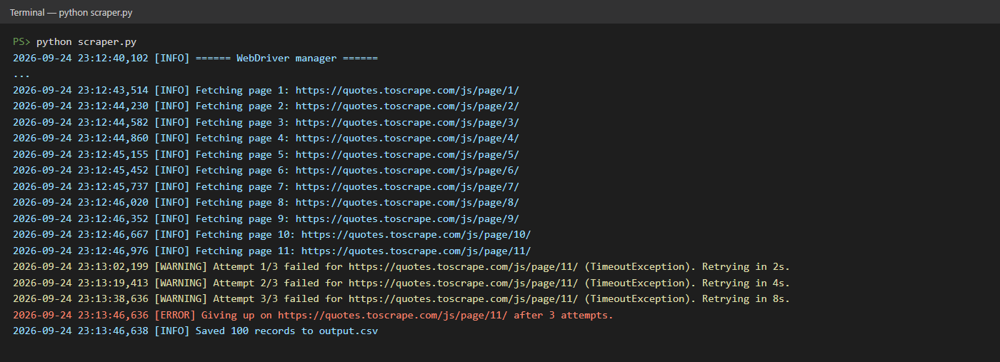
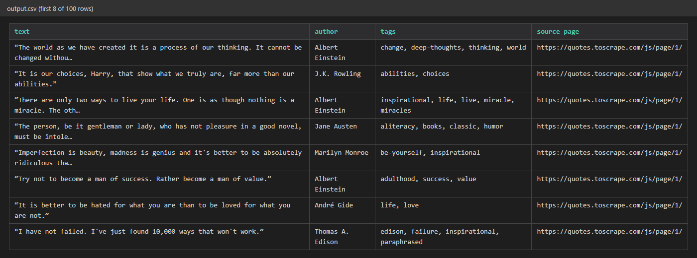

# Dynamic Site Scraper (Selenium + selenium-stealth)

For sites that render content client-side with JavaScript -- infinite
scroll feeds, dashboards, "Load more" buttons -- where a plain HTTP
request just returns an empty page shell.

## What this demonstrates for a client-facing gig

- Real browser automation via Selenium, driven headlessly for
  unattended runs
- `selenium-stealth` to reduce fingerprints that anti-bot systems
  check for (`navigator.webdriver`, WebGL vendor strings, etc.)
- `webdriver-manager` so there's no manual ChromeDriver
  install/version-matching step on the client's machine
- Retry-with-backoff on every page load, plus structured logging --
  the script reports what it's doing and recovers from transient
  failures instead of crashing

## Run it

```bash
pip install -r requirements.txt
python scraper.py
```

Output lands in `output.csv`.

## Sample Output




Terminal log from a real run -- note the retry-with-backoff kicking
in and recovering gracefully instead of crashing the whole job:

```text
2026-09-16 23:34:41,836 [INFO] ====== WebDriver manager ======
2026-09-16 23:34:44,799 [INFO] Fetching page 1: https://quotes.toscrape.com/js/page/1/
2026-09-16 23:34:45,582 [INFO] Fetching page 2: https://quotes.toscrape.com/js/page/2/
...
2026-09-16 23:34:48,477 [INFO] Fetching page 11: https://quotes.toscrape.com/js/page/11/
2026-09-16 23:35:03,705 [WARNING] Attempt 1/3 failed for https://quotes.toscrape.com/js/page/11/ (TimeoutException). Retrying in 2s.
2026-09-16 23:35:20,925 [WARNING] Attempt 2/3 failed for https://quotes.toscrape.com/js/page/11/ (TimeoutException). Retrying in 4s.
2026-09-16 23:35:40,143 [WARNING] Attempt 3/3 failed for https://quotes.toscrape.com/js/page/11/ (TimeoutException). Retrying in 8s.
2026-09-16 23:35:48,144 [ERROR] Giving up on https://quotes.toscrape.com/js/page/11/ after 3 attempts.
2026-09-16 23:35:48,145 [INFO] Saved 100 records to output.csv
```

`output.csv`:

| text | author | tags | source_page |
|---|---|---|---|
| "The world as we have created it is a process of our thinking..." | Albert Einstein | change, deep-thoughts, thinking, world | .../page/1/ |
| "It is our choices, Harry, that show what we truly are..." | J.K. Rowling | abilities, choices | .../page/1/ |
| "There are only two ways to live your life..." | Albert Einstein | inspirational, life, live, miracle, miracles | .../page/1/ |

## Adapting for a real client job

- Swap `BASE_URL` and the `By.CLASS_NAME` selectors for the target
  site's actual structure
- For infinite-scroll pages (no numbered pagination), replace the
  `page_num` loop with a scroll-and-wait loop:
  `driver.execute_script("window.scrollTo(0, document.body.scrollHeight)")`
  then wait for new elements to appear
- If the target site requires login, add a one-time authenticated
  session step before the scrape loop

## When to reach for this vs. Scrapy

Use Scrapy (see project 01) by default -- it's faster and lighter.
Reach for Selenium only when the content genuinely doesn't exist in
the page source until JavaScript runs, or the flow needs real
interaction (clicks, scrolls, form fills, login).
